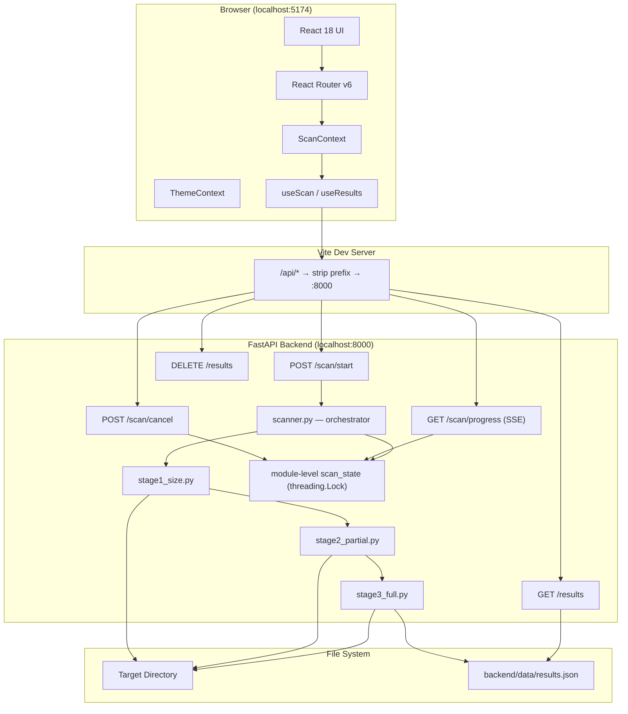
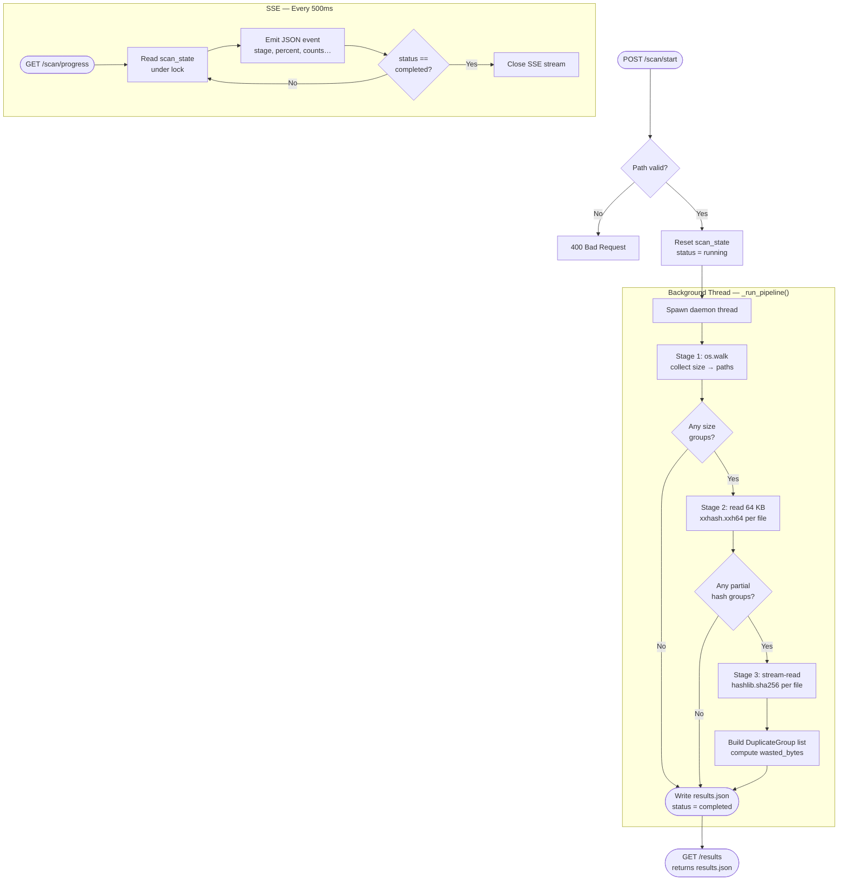
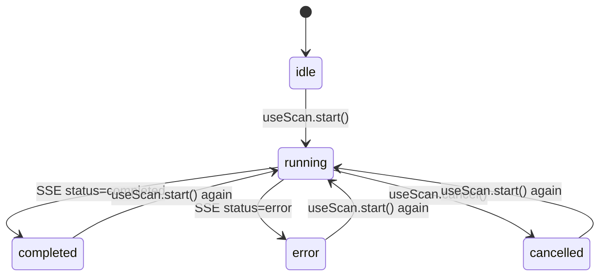
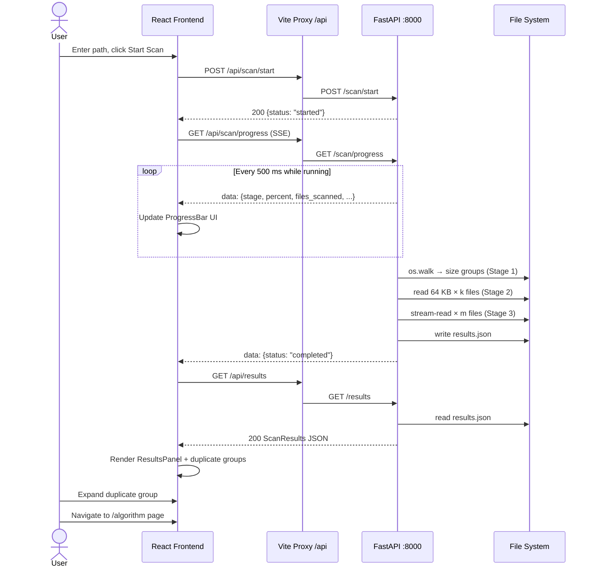
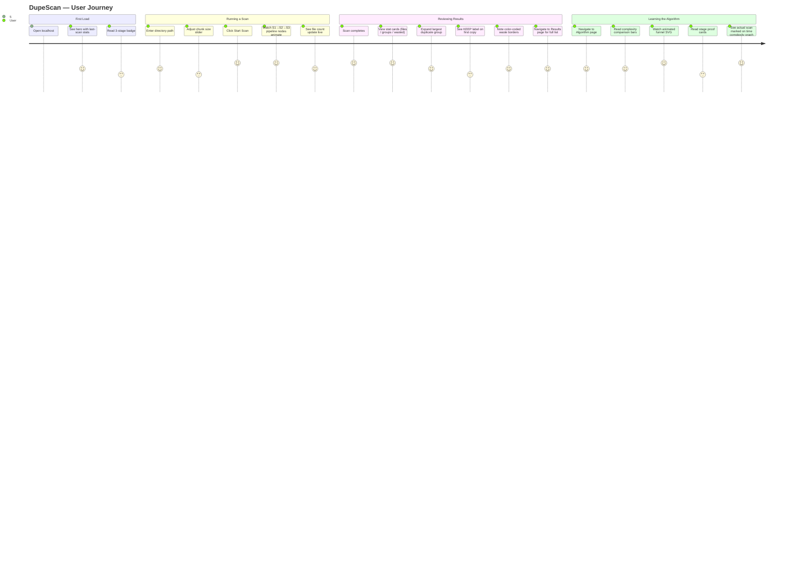
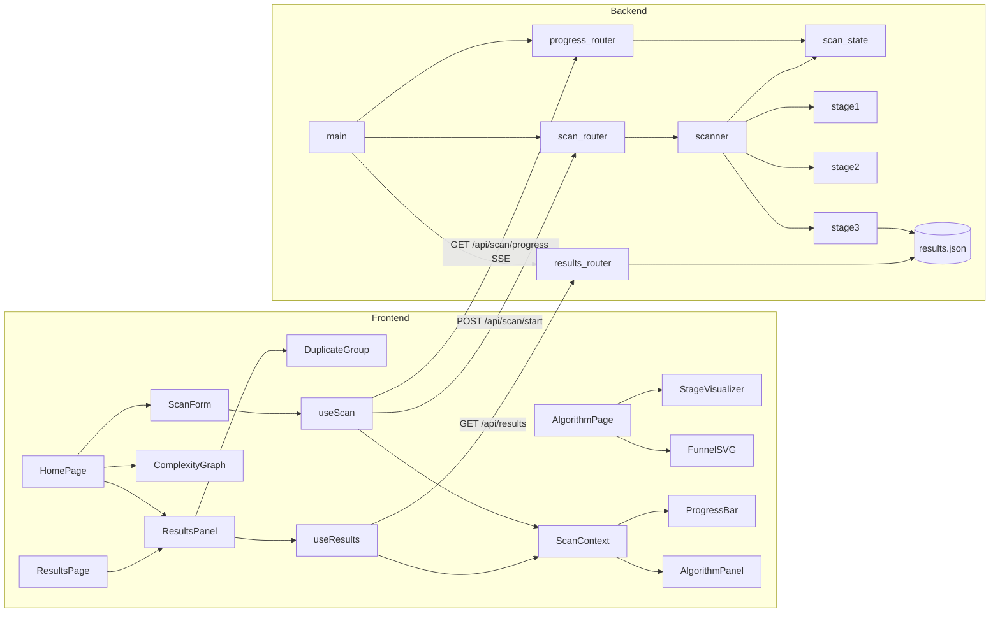
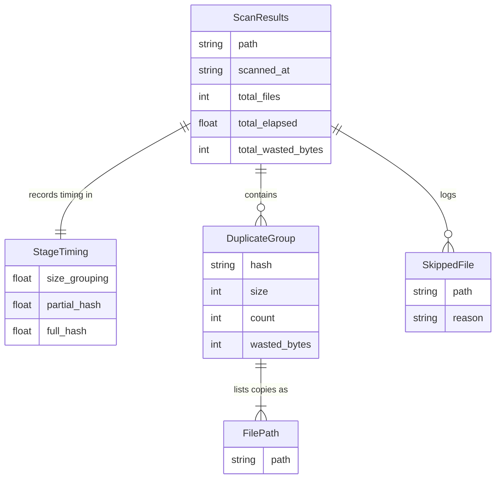

# DupeScan — Large File Duplicate Detection

A full-stack web application that detects duplicate files using a three-stage algorithmic pipeline, built as a demonstration project for the **Design and Analysis of Algorithms (DAA)** course at RV College of Engineering.

---

## Table of Contents

- [Project Overview](#project-overview)
- [System Architecture](#system-architecture)
- [Folder Structure](#folder-structure)
- [File Explanations](#file-explanations)
- [Execution Flow](#execution-flow)
- [API Documentation](#api-documentation)
- [Diagrams](#diagrams)
- [Setup and Running](#setup-and-running)

---

## Project Overview

DupeScan scans a directory, groups files by content identity, and reports which files are duplicates — along with exactly how much disk space could be reclaimed by deleting them.

The core algorithmic contribution is a **three-stage funnel** that avoids reading every byte of every file by eliminating candidates early using progressively more expensive checks:

| Stage | Algorithm              | Complexity | What it eliminates                                      |
| ----- | ---------------------- | ---------- | ------------------------------------------------------- |
| 1     | Size grouping          | O(n log n) | Files with unique sizes (~90% of all files)             |
| 2     | Partial xxHash (64 KB) | O(k·P)     | Same-size files that differ in their first 64 KB        |
| 3     | Full SHA-256           | O(m·F)     | Remaining candidates that differ beyond the first chunk |

**vs. brute force:** O(n²·F) — read every file fully and compare every pair.

At n = 134,949 files (real Downloads scan), the pipeline is approximately **7,900× faster** than brute force.

### Tech Stack

| Layer     | Technology                               |
| --------- | ---------------------------------------- |
| Frontend  | React 18, TypeScript, Vite, Tailwind CSS |
| Backend   | Python 3.10+, FastAPI, Pydantic v2       |
| Hashing   | xxHash (partial), hashlib SHA-256 (full) |
| Streaming | Server-Sent Events (SSE)                 |
| Storage   | Local JSON (`backend/data/results.json`) |
| Testing   | pytest, FastAPI TestClient, httpx        |

---

## System Architecture

### Architecture Diagram



### Key Design Decisions

- **No database.** Results are written to a single JSON file after the scan completes. This keeps the stack minimal and the output inspectable.
- **Daemon thread for scanning.** The pipeline runs in a background thread so FastAPI can keep serving SSE events without blocking.
- **`threading.Lock` on `scan_state`.** A module-level dict shared between the HTTP thread and the scanner thread. All mutations are guarded by a lock to avoid races.
- **Vite proxy with `/api` prefix.** Prevents the dev server from intercepting React Router routes like `/results` by routing only `/api/*` to the backend.

---

## Folder Structure

```
lf_dupe/
├── backend/
│   ├── app/
│   │   ├── main.py                  # FastAPI app entry point, CORS config
│   │   ├── api/
│   │   │   ├── scan.py              # POST /scan/start, POST /scan/cancel
│   │   │   ├── progress.py          # GET /scan/progress (SSE generator)
│   │   │   └── results.py           # GET /results, DELETE /results
│   │   ├── core/
│   │   │   ├── scanner.py           # Pipeline orchestrator + scan_state
│   │   │   ├── stage1_size.py       # Size grouping (O(n log n))
│   │   │   ├── stage2_partial.py    # Partial xxHash-64 (O(k·P))
│   │   │   ├── stage3_full.py       # Full SHA-256 (O(m·F))
│   │   │   └── models.py            # Pydantic models: ScanConfig, Progress, ScanResults…
│   │   └── services/
│   │       └── file_utils.py        # Shared file I/O helpers
│   ├── data/
│   │   └── results.json             # Persisted scan output (auto-created)
│   ├── scripts/
│   │   └── setup_demo.py            # Creates demo directory with known duplicates
│   ├── tests/
│   │   ├── test_scanner.py          # End-to-end pipeline tests
│   │   ├── test_stages.py           # Per-stage unit tests
│   │   └── test_sse.py              # SSE endpoint tests (18 tests)
│   └── requirements.txt
│
├── frontend/
│   ├── index.html                   # Vite entry + Google Fonts import
│   ├── vite.config.ts               # Vite config + /api proxy
│   ├── tailwind.config.ts           # Tailwind + CSS variable color tokens
│   ├── src/
│   │   ├── main.tsx                 # React root mount
│   │   ├── App.tsx                  # BrowserRouter, NavBar, route definitions
│   │   ├── index.css                # CSS variables (dark/light), animations, utilities
│   │   ├── pages/
│   │   │   ├── HomePage.tsx         # Hero + ScanForm/ComplexityGraph + ResultsPanel
│   │   │   ├── ResultsPage.tsx      # Full results view (stat cards + duplicate list)
│   │   │   └── AlgorithmPage.tsx    # Educational walkthrough + animated SVG funnel
│   │   ├── components/
│   │   │   ├── ScanForm.tsx         # Path input, partial hash toggle, chunk size slider
│   │   │   ├── ProgressBar.tsx      # 3-node pipeline visual (S1→S2→S3) with SSE data
│   │   │   ├── ResultsPanel.tsx     # Stat cards + complexity table + paginated groups
│   │   │   ├── DuplicateGroup.tsx   # Collapsible card, color-coded by waste size
│   │   │   ├── ComplexityGraph.tsx  # SVG log-scale chart: O(n²) vs O(n log n)
│   │   │   ├── AlgorithmPanel.tsx   # Stage cards with real timing from SSE
│   │   │   ├── StageVisualizer.tsx  # Scroll-triggered animated progress bar per stage
│   │   │   └── ui/                  # Hand-built shadcn/ui primitives (no Radix)
│   │   │       ├── button.tsx
│   │   │       ├── card.tsx
│   │   │       ├── badge.tsx
│   │   │       ├── input.tsx
│   │   │       ├── label.tsx
│   │   │       ├── progress.tsx
│   │   │       ├── switch.tsx
│   │   │       ├── collapsible.tsx
│   │   │       └── alert.tsx
│   │   ├── hooks/
│   │   │   ├── useScan.ts           # Start/cancel scan, manage EventSource lifecycle
│   │   │   └── useResults.ts        # Load/clear results from API into context
│   │   ├── context/
│   │   │   ├── ScanContext.tsx      # Global: scanStatus, progress, results, error
│   │   │   └── ThemeContext.tsx     # dark/light toggle persisted to localStorage
│   │   └── lib/
│   │       ├── api.ts               # Typed fetch wrappers for all backend endpoints
│   │       └── utils.ts             # cn(), formatBytes(), formatTime(), truncateHash()
│   └── package.json
│
├── GUIDE.md                         # User guide: how to run and test with own files
└── README.md                        # This file
```

---

## File Explanations

### Backend

#### `app/main.py`

FastAPI application factory. Registers the three API routers (`scan`, `progress`, `results`) and configures CORS to allow requests from the Vite dev server (`localhost:5173`, `localhost:5174`).

#### `app/core/models.py`

All Pydantic models used across the app:

| Model            | Purpose                                                                      |
| ---------------- | ---------------------------------------------------------------------------- |
| `ScanConfig`     | Request body for `POST /scan/start` — path, chunk_size, use_partial_hash     |
| `Progress`       | SSE payload — stage, percent, files_scanned, stage timings, error            |
| `StageTiming`    | Per-stage elapsed seconds: size_grouping, partial_hash, full_hash            |
| `DuplicateGroup` | One group of confirmed duplicates — hash, size, count, files[], wasted_bytes |
| `SkippedFile`    | A file that could not be read — path + reason                                |
| `ScanResults`    | Complete scan output written to results.json                                 |

#### `app/core/scanner.py`

The orchestrator. Owns the module-level `scan_state` dict and `_lock`. Exposes two public functions:

- `start_scan(config)` — validates the path, resets state, spawns a daemon thread running `_run_pipeline()`
- `cancel_scan()` — sets `scan_state["status"] = "cancelled"`; the pipeline checks this cooperatively

The pipeline thread calls Stage 1 → 2 → 3 in sequence, updating `scan_state` after each file. On completion it serialises a `ScanResults` to `backend/data/results.json`.

#### `app/core/stage1_size.py`

Walks the directory tree with `os.walk(follow_symlinks=False)`, collects `(size, path)` pairs, groups by size, and discards singletons. Returns `{size: [paths]}` where every bucket has ≥ 2 files.

#### `app/core/stage2_partial.py`

For each size bucket, reads the first `chunk_size` bytes and computes `xxhash.xxh64`. Re-buckets by digest, discards singletons. Updates `scan_state["stage2_scanned"]` per file so the frontend can show Stage 2 progress independently.

#### `app/core/stage3_full.py`

For each partial-hash bucket, stream-reads the complete file in 64 KB blocks and updates a `hashlib.sha256` digest. Re-buckets by `sha256:<hex>`, discards singletons. Updates `scan_state["stage3_scanned"]` per file.

#### `app/api/progress.py`

SSE generator that polls `scan_state` every 500 ms and emits a JSON payload. Builds the `percent` field using **per-stage denominators** — `stage2_total` during Stage 2 and `stage3_total` during Stage 3 — so progress never overflows 100% or jumps backwards.

#### `app/api/scan.py`

Two endpoints: `POST /scan/start` validates the path exists and calls `scanner.start_scan()`. `POST /scan/cancel` calls `scanner.cancel_scan()`.

#### `app/api/results.py`

`GET /results` reads `backend/data/results.json` and returns the parsed object. Returns `{"message": "No results"}` if the file does not exist. `DELETE /results` deletes the file.

---

### Frontend

#### `src/App.tsx`

Root component. Wraps the app in `ThemeProvider` and `ScanProvider`, sets up `BrowserRouter` with three routes (`/`, `/results`, `/algorithm`), and renders the sticky `NavBar` with the gradient DupeScan logo.

#### `src/context/ScanContext.tsx`

Single source of truth for scan state. Holds `scanStatus`, `progress` (live SSE payload), `results` (final `ScanResults` object), and `error`. All components read from here; only `useScan` and `useResults` write to it.

#### `src/hooks/useScan.ts`

Manages the full scan lifecycle:

1. Calls `POST /api/scan/start`
2. Opens an `EventSource` to `GET /api/scan/progress`
3. Parses each SSE event and updates context via `setProgress` / `setScanStatus`
4. On `status === "completed"`, fetches results and calls `setResults`
5. On `es.onerror`, auto-reconnects after 3 seconds

#### `src/hooks/useResults.ts`

Fetches results from `GET /api/results` into context. Used by `ResultsPanel` and `HomePage` to load the last scan on page load.

#### `src/components/ComplexityGraph.tsx`

SVG chart on a **logarithmic Y axis** plotting O(n²·F) and O(n log n) from n = 0 to 200,000. Uses a log scale so both curves are visible despite the parabola dominating linearly. If results are loaded, marks the actual scan's n on both curves and displays the speedup ratio in the legend.

#### `src/lib/api.ts`

All fetch calls go through a single typed `request<T>()` helper that throws on non-2xx. The `BASE` constant reads `VITE_API_URL` from the environment (defaults to `/api`), which Vite proxies to `http://localhost:8000` with the prefix stripped.

---

## Execution Flow

### Scan Pipeline (Backend)



### Frontend State Machine



---

## API Documentation

Base URL (dev): `http://localhost:8000`  
All requests go through the Vite proxy at `/api/*` → `http://localhost:8000/*`.

### `POST /scan/start`

Start a new scan. Any running scan is replaced.

**Request body**

```json
{
  "path": "/home/user/documents",
  "chunk_size": 65536,
  "use_partial_hash": true
}
```

| Field              | Type    | Default  | Description                              |
| ------------------ | ------- | -------- | ---------------------------------------- |
| `path`             | string  | required | Absolute path to scan                    |
| `chunk_size`       | integer | 65536    | Bytes to read in Stage 2 (4 KB – 512 KB) |
| `use_partial_hash` | boolean | true     | Skip Stage 2 if false                    |

**Response**

```json
{ "status": "started" }
```

**Errors**

| Code | Reason                                    |
| ---- | ----------------------------------------- |
| 400  | Path does not exist or is not a directory |
| 409  | Scan already running                      |

---

### `POST /scan/cancel`

Cooperatively cancel the running scan. The pipeline checks the cancel flag between files.

**Response**

```json
{ "status": "cancelled" }
```

---

### `GET /scan/progress`

Server-Sent Events stream. Connect once after `POST /scan/start`; the server sends events until the scan ends.

**Event format** (one per message, every ~500 ms)

```json
{
  "stage": "partial_hash",
  "status": "running",
  "percent": 42.7,
  "files_scanned": 1240,
  "total_files": 14837,
  "stage1_total": 14837,
  "stage2_total": 14837,
  "stage3_total": 1200,
  "stage_times": {
    "size_grouping": 41.97,
    "partial_hash": null,
    "full_hash": null
  },
  "total_elapsed": 55.3,
  "error": null
}
```

| Field          | Description                                                          |
| -------------- | -------------------------------------------------------------------- |
| `stage`        | `idle` \| `size_grouping` \| `partial_hash` \| `full_hash` \| `done` |
| `status`       | `idle` \| `running` \| `completed` \| `error` \| `cancelled`         |
| `percent`      | 0–100, computed against the current stage's denominator              |
| `stage2_total` | Files entering Stage 2 (null until Stage 2 starts)                   |
| `stage3_total` | Files entering Stage 3 (null until Stage 3 starts)                   |

Stream closes when `status` is `completed`, `error`, or `cancelled`.

---

### `GET /results`

Return the last completed scan result.

**Response (success)**

```json
{
  "scanned_at": "2026-06-13T12:45:00Z",
  "path": "C:/Users/kartik/Downloads",
  "total_files": 134949,
  "total_elapsed": 322.01,
  "total_wasted_bytes": 1012600832,
  "stage_times": {
    "size_grouping": 41.97,
    "partial_hash": 208.72,
    "full_hash": 71.17
  },
  "duplicate_groups": [
    {
      "hash": "sha256:c08885ea...",
      "size": 161185792,
      "count": 2,
      "files": [
        "C:/Users/kartik/Downloads/UnityHubSetup-x64.exe",
        "C:/Users/kartik/Downloads/UnityHub/UnityHubSetup-x64.exe"
      ],
      "wasted_bytes": 161185792
    }
  ],
  "skipped_files": [
    {
      "path": "C:/Users/kartik/Downloads/locked.dll",
      "reason": "PermissionError"
    }
  ]
}
```

**Response (no results)**

```json
{ "message": "No results available" }
```

---

### `DELETE /results`

Delete `backend/data/results.json`.

**Response**

```json
{ "status": "cleared" }
```

---

## Diagrams

### API Request Flow



---

### User Journey



---

### System Architecture (Component View)



---

### ER Diagram — Data Model



---

## Setup and Running

### Prerequisites

| Tool    | Minimum version |
| ------- | --------------- |
| Python  | 3.10            |
| Node.js | 18              |
| npm     | 9               |

---

### 1 — Clone the repository

```bash
git clone <repo-url>
cd lf_dupe
```

---

### 2 — Backend setup

```bash
cd backend

# Create virtual environment
python -m venv venv

# Activate — Windows
.\venv\Scripts\activate

# Activate — macOS / Linux
source venv/bin/activate

# Install dependencies
pip install -r requirements.txt
```

**`requirements.txt` packages**

| Package           | Version | Purpose                        |
| ----------------- | ------- | ------------------------------ |
| fastapi           | 0.115.0 | Web framework                  |
| uvicorn[standard] | 0.30.6  | ASGI server                    |
| pydantic          | 2.8.2   | Request/response models        |
| xxhash            | 3.5.0   | Fast partial hashing (Stage 2) |
| pytest            | 8.3.3   | Test runner                    |
| httpx             | 0.27.2  | Async test client              |
| python-multipart  | 0.0.12  | Form data support              |

Start the server:

```bash
uvicorn app.main:app --reload
# → http://localhost:8000
# → Docs: http://localhost:8000/docs
```

---

### 3 — Frontend setup

```bash
cd frontend

npm install

npm run dev
# → http://localhost:5174
```

The Vite config proxies all `/api/*` requests to `http://localhost:8000` with the `/api` prefix stripped, so React Router routes like `/results` are never intercepted by the proxy.

---

### 4 — Running tests

```bash
cd backend

# All 18 tests
pytest tests/ -v

# Single file
pytest tests/test_sse.py -v
```

Tests use FastAPI's `TestClient` with a patched `scan_state` fixture so SSE generators terminate instead of streaming forever.

---

### 5 — Generate demo data

```bash
cd backend
python scripts/setup_demo.py
# Creates backend/demo_data/ with known duplicate files
```

Then scan `backend/demo_data` in the UI to verify the pipeline produces the expected groups.

---

### Environment variables

| Variable       | Default | Description                                |
| -------------- | ------- | ------------------------------------------ |
| `VITE_API_URL` | `/api`  | Override backend URL for production builds |

For a production deployment (e.g. Vercel frontend + separate FastAPI host):

```bash
# frontend/.env.production
VITE_API_URL=https://your-api-host.com
```

---

## Academic Context

This project was submitted for the **Design and Analysis of Algorithms** course at **RV College of Engineering**.

The central demonstration is the contrast between:

- **Naive O(n²·F):** Compare every file against every other file by reading full content — infeasible for large directories
- **Pipeline O(n log n + k·P + m·F):** Eliminate candidates stage by stage so the expensive SHA-256 reads only touch a tiny fraction of files

On a real 134,949-file Downloads directory:

- Stage 1 eliminated ~120,000 files in 42 s
- Stage 2 eliminated most remaining candidates in 209 s
- Stage 3 confirmed 14,645 duplicate groups in 71 s
- Total: **322 s** vs an estimated **700,000+ s** for brute force
